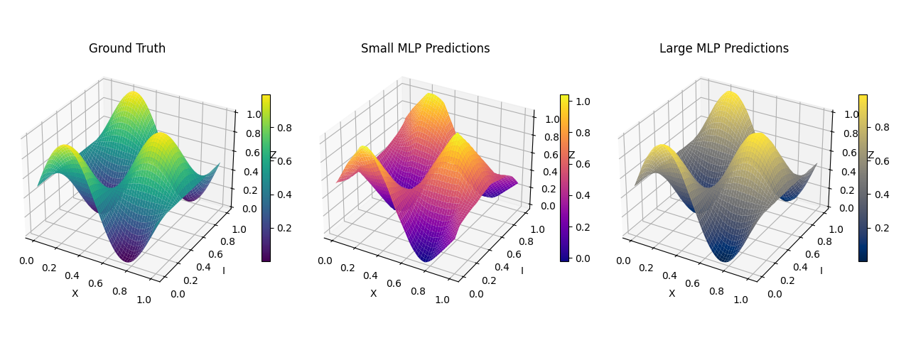

# aa-energi-2025


# 1. MLP Sine-Cosine Regression

A quick demonstration of using **PyTorch** to fit a 2D sine-cosine function using two different Multi-Layer Perceptron (MLP) architectures:

- **Small MLP** (moderate capacity)  
- **Large MLP** (high capacity, to overfit and capture fine details)



## Overview

1. **Data**  
   We have $(x, i)$ pairs and a target $z = \sin(\cos(x)) + \sin(\cos(i))$.  
   - Inputs are stored in `data/X_sincos.txt`
   - Targets are stored in `data/y_sincos.txt`
   - Data provided by Å Energi.

2. **Models**  
   - **SmallMLP**: 2 → 100 → 100 → 1 (with ReLU activations)  
   - **LargeMLP**: 2 → 100 → 500 → 500 → 100 → 1 (with ReLU activations)

3. **Training**  
   - We use **MSE Loss** and **Adam Optimizer** in PyTorch.  
   - The **LargeMLP** is intentionally over-parameterized to fit (even overfit) the data extremely well.

4. **Results**  
   - We compare the ground truth surface with predictions from both MLPs in a 3D plot.


> *From left to right*:  
> **(1)** Ground Truth  
> **(2)** Small MLP Predictions  
> **(3)** Large MLP Predictions

## Quickstart

1. **Install Dependencies**  
   ```bash
   pip install torch matplotlib numpy
   ```
2. **Run**  
   ```bash
   python 1-sincos.py
   ```
   - Adjust the script’s hyperparameters (epochs, learning rate) if desired.

3. **Plot**  
   The script automatically displays a 3D surface plot to compare predictions.

## Key Takeaways

- **Small vs. Large Models**: A larger network can approximate the target function very closely, but it may overfit when data is limited.  
- **Visualization**: 3D surface plots help us visually assess how well the model captures the true underlying function.  
- **PyTorch**: Shows how easy it is to build and train MLPs on custom data with just a few lines of Python code.

