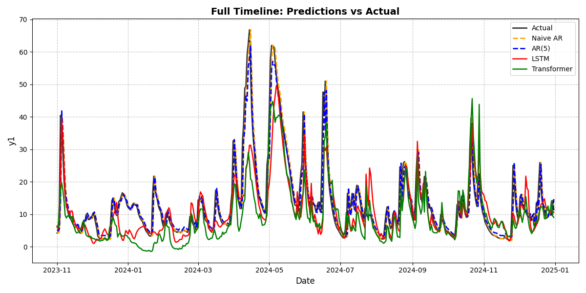
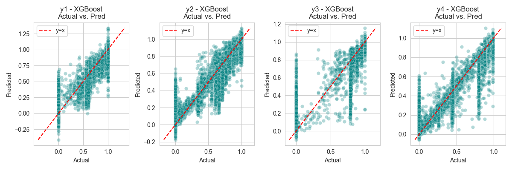

# Å Energi - Exploration of Datasets 2025

---

## Introduction  

This project explores three distinct machine learning challenges, ranging from fundamental function approximation to complex real-world forecasting. We begin with a demonstration of PyTorch's capabilities in fitting a sine-cosine function, followed by an investigation into time-series forecasting on a small dataset, where we compare deep learning models to classical autoregressors. Finally, we tackle a large-scale hydropower dataset, evaluating whether a carefully tuned neural network can outperform traditional gradient-boosting models in a multi-output regression task.

---

# 1. MLP with Sine-Cosine Regression

A quick demonstration of using **PyTorch** to fit a 2D sine-cosine function using two different Multi-Layer Perceptron (MLP) architectures:

- **Small MLP** (moderate capacity)  
- **Large MLP** (high capacity, to overfit and capture fine details)


# 2. Time-Series Forecasting for Small Data - Battling the Autoregressor

**_We bravely attempted to beat the classical autoregressors using modern deep learning on a very small dataset—and it was quite a challenge!_**



Below is a **short introduction** for your project, followed by a **teaser for part 3** in the same style as your existing sections, and finally a **small index** referencing each section. Feel free to tweak the wording and headings as needed.

## 3. Large Hydropower Modeling - Revenge of the MLP!

**_After exploring time-series forecasting on a small dataset, we turned our attention to a significantly larger challenge—a hydropower dataset from Å Energi, containing millions of rows and multiple target variables. Our goal was to determine whether a carefully tuned neural network could outperform traditional gradient-boosting models in a complex multi-output regression task. Along the way, we addressed issues of dimensionality, optimized hyperparameters, and compared model performance to find the most effective approach._**


---

## Quick Index

- [1. MLP Sine-Cosine Regression](#1-mlp-sine-cosine-regression)  
- [2. Time-Series Forecasting with Small Data - Battling the Autoregressor](#2-time-series-forecasting-with-small-data---battling-the-autoregressor)  
- [3. Large Hydropower Modeling - Revenge of the MLP!](#3-large-hydropower-modeling---revenge-of-the-mlp)  


# 1. MLP Sine-Cosine Regression

A quick demonstration of using **PyTorch** to fit a 2D sine-cosine function using two different Multi-Layer Perceptron (MLP) architectures:

- **Small MLP** (moderate capacity)  
- **Large MLP** (high capacity, to overfit and capture fine details)


## Overview

1. **Data**  
   We have $(x, i)$ pairs and a target $z = \sin(\cos(x)) + \sin(\cos(i))$.  
   - Inputs are stored in `data/X_sincos.txt`
   - Targets are stored in `data/y_sincos.txt`
   - Data provided by Å Energi.

2. **Models**  
   - **SmallMLP**: 2 → 100 → 100 → 1 (with ReLU activations)  
   - **LargeMLP**: 2 → 100 → 500 → 500 → 100 → 1 (with ReLU activations)

3. **Training**  
   - We use **MSE Loss** and **Adam Optimizer** in PyTorch.  
   - The **LargeMLP** is intentionally over-parameterized to fit (even overfit) the data extremely well.

4. **Results**  
   - We compare the ground truth surface with predictions from both MLPs in a 3D plot.


> *From left to right*:  
> **(1)** Ground Truth  
> **(2)** Small MLP Predictions  
> **(3)** Large MLP Predictions

## Quickstart

1. **Install Dependencies**  
   ```bash
   pip install torch matplotlib numpy
   ```
2. **Run**  
   ```bash
   python 1-sincos.py
   ```
   - Adjust the script’s hyperparameters (epochs, learning rate) if desired.

3. **Plot**  
   The script automatically displays a 3D surface plot to compare predictions.

## Key Takeaways

- **Small vs. Large Models**: A larger network can approximate the target function very closely, but it may overfit when data is limited.  
- **Visualization**: 3D surface plots help us visually assess how well the model captures the true underlying function.  
- **PyTorch**: Shows how easy it is to build and train MLPs on custom data with just a few lines of Python code.

----


# **2. Time-Series Forecasting with Small Data - Battling the Autoregressor**  

**_We set out to challenge classical autoregressors using deep learning on a tiny dataset—and let's just say, the results were humbling._**  

  

## **Overview**  

This project explores different approaches to forecasting a daily time series with only **~4000 observations** (after accounting for lag features). Our goal was to see if modern deep learning models—LSTMs and Transformers—could outperform classical statistical methods in a low-data setting.  

We tested four models:  

1. **Naive AR**: The simplest baseline—just assume today's value will be the same as yesterday’s.  
2. **AR(5)**: A linear autoregressive model using the past five days to predict the next day.  
3. **LSTM**: A recurrent neural network trained on sequences of 30 days.  
4. **Transformer**: A self-attention model, also using a 30-day window.  

### **Did Deep Learning Win?**  

Not this time. With only a few thousand data points and just three exogenous variables (`x1, x2, x3`), the neural networks struggled to extract meaningful patterns. The AR models, especially AR(5), performed significantly better because:  

- The dataset is **very small** (~4000 rows), limiting the learning capacity of deep models.  
- The exogenous features have **weak explanatory power**, meaning they don't contribute much to the forecast.  
- The time series itself is **highly autoregressive**, meaning past values alone provide a strong predictive signal—something the simpler AR models handle with ease.  

## **Final Metrics**  

| Model        | MAE  | MSE  |  
|-------------|------|------|  
| **Naive AR**  | **2.626**  | **19.377**  |  
| **AR(5)**     | **2.466**  | **17.183**  |  
| LSTM         | 4.930  | 59.427  |  
| Transformer  | 5.853  | 70.126  |  

Both the LSTM and Transformer were convincingly outperformed by the naive and AR(5) models. The deep learning models had nearly **double the MAE** and **three to four times the MSE**. A clear win for the classical approach in this scenario.  

---

## **Key Plots**  

### **Prediction Timeline**  

This plot compares actual vs. predicted values over time. The closer a model's predictions track the real values, the better it performs.  

📌 **What to look for:**  
- Which models stay closest to the actual values - Here the autoregressors are just doing a better job.
- Do any models consistently lag behind or overshoot the target? There is no consistent lag, indicating everything is set up correctly and hyperparameters are reasonable.
- How much noise do the LSTM and Transformer introduce compared to AR(5)? The answer is that there is significant noise and random spikes - The data set is too small for the neural nets to be able to shine! 

  

### **Absolute Error Over Time**  

This plot shows how each model’s absolute error evolves over time. It helps identify periods where models struggle the most.  

📌 **What to look for:**  
- Are there specific time periods where errors spike? The large spikes coincide with large movements in $y$, and because the data set does not contain enough explanatory power, the LSTMS and transformers make large errors.
- Does one model consistently make larger errors than the others?
- Do the deep learning models exhibit unstable or erratic behavior?  

  

### **MAE & MSE Comparison**  

These bar charts provide a direct numerical comparison of how well each model performed.  

- **MAE (Mean Absolute Error)** tells us the average size of errors in an intuitive way.  
- **MSE (Mean Squared Error)** emphasizes larger errors, making it more sensitive to extreme mistakes.  

📌 **What to look for:**  
- The AR(5) model achieves the lowest MAE and MSE—winning this challenge.  
- The LSTM and Transformer have significantly higher errors, struggling with the limited data.  
- The naive model performs surprisingly well, showing the strong autoregressive nature of the data.  

**MAE Comparison:**  
  

**MSE Comparison:**  
  

---

## **How to Run the Code**  

1. Install dependencies:  
   ```bash
   pip install numpy pandas matplotlib torch scikit-learn
   ```
2. Run the main script:  
   ```bash
   python 2-tahps.py
   ```
3. Check the console output and generated plots.  

---

## **Conclusion**  

Despite our best efforts, **deep learning didn’t win this battle**—but that’s not surprising. AR(5) and even the naive model performed well because past values alone contained enough predictive power.  

However, in a scenario with **more data** and **stronger exogenous features**, the LSTM and Transformer could shine. For now, this project highlights an important lesson in time-series forecasting: **sometimes, simpler is better.**  

Want to experiment? Try adding additional features, tweaking hyperparameters, or using different architectures to see if you can tip the scales in favor of deep learning!  

---

# 3. Large Hydropower Modeling - Revenge of the MLP!

> **Goal:** Predict multiple targets (y1..y4) from 10 input variables (x1..x10).  
> **Data:** Provided by Å Energi, with millions of rows of operational logs (we assume).

## Table of Contents

1. [Overview](#overview)  
2. [Models](#models)  
   - [Linear Regression](#linear-regression)  
   - [XGBoost](#xgboost)  
   - [Multi-Layer Perceptron (MLP)](#multi-layer-perceptron-mlp)  
3. [Results](#results)  
4. [Future Improvements](#future-improvements)  
5. [Repository Structure](#repository-structure)

---

## Overview

We tried three main approaches to see which method best predicts our 4 target variables:

1. A classic **Linear Regression** baseline.  
2. A **tree-based** ensemble method: **XGBoost**.  
3. A **neural network** approach using a multi-output **MLP** in PyTorch.

All scripts produce **metrics** like RMSE (Root Mean Squared Error) and MAE (Mean Absolute Error). We used train/test splits of 80/20 and tested each method’s performance.

---

## Models

### Linear Regression

We used a simple **multi-output linear model**: for each target (y1..y4), it tries to fit a linear function of x1..x10. Unsurprisingly, linear regression did okay, but it didn’t fully capture complex relationships. Our best MSE hovered around 0.06–0.07 for most targets, translating to RMSE of about 0.24–0.28. Great for interpretability, but maybe not for minimal error.

**Key Script**: [`3-vannkraft-linreg.py`](3-vannkraft-linreg.py)

### XGBoost

**XGBoost** (eXtreme Gradient Boosting) is famously strong on tabular data—often beating neural nets. We used **RandomizedSearchCV** to tune hyperparams like `max_depth`, `learning_rate`, `subsample`, etc., for each target.

**Highlights**:
- Achieved RMSE around **0.05–0.07** for y1..y4.
- Blazing fast on CPU with `tree_method='hist'`.
- Typically outperforms linear models on non-linear data.

**Key Script**: [`3-vannkraft-xgboost.py`](3-vannkraft-xgboost.py)

### Multi-Layer Perceptron (MLP)

“Neural networks are overrated on structured data!” Some folks say that. However, we wanted to see if a well-tuned MLP could match or surpass XGBoost. We built a **multi-output** MLP in PyTorch with `output_dim=4` so it jointly predicts y1..y4.

After a thorough hyperparameter search (despite some docstring drama with skorch in Python 3.13), we found a sweet spot with:

- **2** hidden layers  
- **512** neurons in each layer  
- **0.01** dropout  
- A learning rate of **0.001**  
- Trained for **134** epochs  

**Key Script**: [`3-vannkraft-mlp.py`](3-vannkraft-mlp.py)

---

## Results

### Linear Regression vs. XGBoost vs. MLP

| Method      | y1 RMSE  | y2 RMSE  | y3 RMSE  | y4 RMSE  | Comments                              |
|-------------|----------|----------|----------|----------|----------------------------------------|
| **LinearReg** | ~0.25  | ~0.24   | ~0.28   | ~0.27   | Decent baseline, but not top dog       |
| **XGBoost**   | ~0.07  | ~0.06   | ~0.06   | ~0.05   | Strong overall; easy to tune           |
| **MLP**       | ~0.06  | ~0.045  | ~0.043  | ~0.033  | Actually beat XGBoost in these tests!  |

> **Note**: The table above is just a quick summary. We got these from actual final test metrics (see below).

**Graphs**




**Detailed Metrics**:

- **XGBoost**  
  
  - y1: MSE=0.005233 (RMSE=0.0723), MAE=0.0364  
  - y2: MSE=0.003901 (RMSE=0.0625), MAE=0.0297  
  - y3: MSE=0.003477 (RMSE=0.0590), MAE=0.0202  
  - y4: MSE=0.002654 (RMSE=0.0515), MAE=0.0170  

- **MLP** 
   
  - y1: MSE=0.003587 (RMSE=0.0599), MAE=0.0231  
  - y2: MSE=0.002085 (RMSE=0.0457), MAE=0.0213  
  - y3: MSE=0.001892 (RMSE=0.0435), MAE=0.0129  
  - y4: MSE=0.001143 (RMSE=0.0338), MAE=0.0128  

- **Linear Regression**  
  
  - y1: MSE=0.064769 (RMSE=0.2545), MAE=0.2177  
  - y2: MSE=0.057551 (RMSE=0.2399), MAE=0.2000  
  - y3: MSE=0.075656 (RMSE=0.2751), MAE=0.2381  
  - y4: MSE=0.071608 (RMSE=0.2676), MAE=0.2291  


**Takeaway**: The MLP slightly outperforms XGBoost in these final runs—somewhat unusual for purely tabular data, but shows that with enough hyperparameter tuning and possibly the large dataset, the MLP can shine.

---

## Future Improvements

We could push these models even further by:

1. **Using PCA**  
   - Our correlation analysis showed some redundant features. Reducing dimensionality to ~4–6 principal components might streamline training and help some models generalize. We’d compare performance with vs. without PCA.
2. **Exploring Additional Models**  
   - Perhaps **LightGBM** or **CatBoost** for better GPU usage or built-in handling of categorical features (if any).
3. **Domain Knowledge**  
   - If we knew more about how hydropower variables relate physically, we could engineer features or apply constraints to improve performance beyond purely data-driven approaches.
4. **Deeper Neural Nets or Transformers**  
   - Not always beneficial for tabular data, but a specialized approach (like TabNet or a custom Transformer) might discover patterns we’re missing.
5. **Extended Hyperparameter Search**  
   - With 25+ million rows, we have a huge dataset. We could harness HPC or GPU resources for a more exhaustive search.

---

## Repository Structure

```
.
├── hyperparam_tuning/
│   ├── hyper_xgboost.py        # Code for searching best XGBoost params
│   ├── hyper_mlp.py            # PyTorch MLP hyperparam search (custom wrapper or skorch)
│   └── ... other experiments
├── 3-vannkraft-linreg.py       # Final multi-output linear regression approach
├── 3-vannkraft-xgboost.py      # Final XGBoost approach + plots
├── 3-vannkraft-mlp.py          # Final MLP approach + plots
├── data/
│   └── vannkraft_data.txt      # The dataset (tab-separated)
└── README.md                   # This file (with results + analysis)
```

We hope this project demonstrates both our comfort with **tabular data modeling** and our willingness to experiment across methods. We had fun chasing those improved RMSE decimals (who knew 0.05 → 0.033 could feel so satisfying?). 

---

**Thanks for reading,** and we hope you enjoy browsing the code and results. If you have any questions—or want to recruit us—please don’t hesitate to reach out! 

---

💬 **Questions or feedback?**  
Feel free to reach out or open an issue—always happy to chat about forecasting!

---
