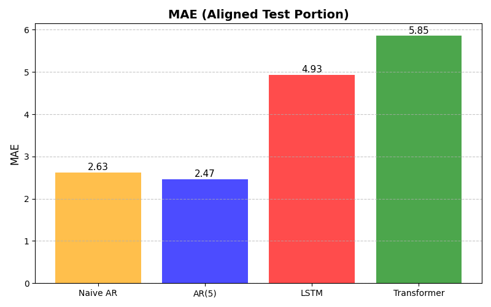

# aa-energi-2025

# 1. MLP Sine-Cosine Regression

A quick demonstration of using **PyTorch** to fit a 2D sine-cosine function using two different Multi-Layer Perceptron (MLP) architectures:

- **Small MLP** (moderate capacity)  
- **Large MLP** (high capacity, to overfit and capture fine details)


# 2. Time-Series Forecasting with Small Data - Battling the Autoregressor

**_We bravely attempted to beat the classical autoregressors using modern deep learning on a very small dataset—and it was quite a challenge!_**


----

# 1. MLP Sine-Cosine Regression

A quick demonstration of using **PyTorch** to fit a 2D sine-cosine function using two different Multi-Layer Perceptron (MLP) architectures:

- **Small MLP** (moderate capacity)  
- **Large MLP** (high capacity, to overfit and capture fine details)


## Overview

1. **Data**  
   We have $(x, i)$ pairs and a target $z = \sin(\cos(x)) + \sin(\cos(i))$.  
   - Inputs are stored in `data/X_sincos.txt`
   - Targets are stored in `data/y_sincos.txt`
   - Data provided by Å Energi.

2. **Models**  
   - **SmallMLP**: 2 → 100 → 100 → 1 (with ReLU activations)  
   - **LargeMLP**: 2 → 100 → 500 → 500 → 100 → 1 (with ReLU activations)

3. **Training**  
   - We use **MSE Loss** and **Adam Optimizer** in PyTorch.  
   - The **LargeMLP** is intentionally over-parameterized to fit (even overfit) the data extremely well.

4. **Results**  
   - We compare the ground truth surface with predictions from both MLPs in a 3D plot.


> *From left to right*:  
> **(1)** Ground Truth  
> **(2)** Small MLP Predictions  
> **(3)** Large MLP Predictions

## Quickstart

1. **Install Dependencies**  
   ```bash
   pip install torch matplotlib numpy
   ```
2. **Run**  
   ```bash
   python 1-sincos.py
   ```
   - Adjust the script’s hyperparameters (epochs, learning rate) if desired.

3. **Plot**  
   The script automatically displays a 3D surface plot to compare predictions.

## Key Takeaways

- **Small vs. Large Models**: A larger network can approximate the target function very closely, but it may overfit when data is limited.  
- **Visualization**: 3D surface plots help us visually assess how well the model captures the true underlying function.  
- **PyTorch**: Shows how easy it is to build and train MLPs on custom data with just a few lines of Python code.

----


# **2. Time-Series Forecasting with Small Data - Battling the Autoregressor**  

**_We set out to challenge classical autoregressors using deep learning on a tiny dataset—and let's just say, the results were humbling._**  

  

## **Overview**  

This project explores different approaches to forecasting a daily time series with only **~4000 observations** (after accounting for lag features). Our goal was to see if modern deep learning models—LSTMs and Transformers—could outperform classical statistical methods in a low-data setting.  

We tested four models:  

1. **Naive AR**: The simplest baseline—just assume today's value will be the same as yesterday’s.  
2. **AR(5)**: A linear autoregressive model using the past five days to predict the next day.  
3. **LSTM**: A recurrent neural network trained on sequences of 30 days.  
4. **Transformer**: A self-attention model, also using a 30-day window.  

### **Did Deep Learning Win?**  

Not this time. With only a few thousand data points and just three exogenous variables (`x1, x2, x3`), the neural networks struggled to extract meaningful patterns. The AR models, especially AR(5), performed significantly better because:  

- The dataset is **very small** (~4000 rows), limiting the learning capacity of deep models.  
- The exogenous features have **weak explanatory power**, meaning they don't contribute much to the forecast.  
- The time series itself is **highly autoregressive**, meaning past values alone provide a strong predictive signal—something the simpler AR models handle with ease.  

## **Final Metrics**  

| Model        | MAE  | MSE  |  
|-------------|------|------|  
| **Naive AR**  | **2.626**  | **19.377**  |  
| **AR(5)**     | **2.466**  | **17.183**  |  
| LSTM         | 4.930  | 59.427  |  
| Transformer  | 5.853  | 70.126  |  

Both the LSTM and Transformer were convincingly outperformed by the naive and AR(5) models. The deep learning models had nearly **double the MAE** and **three to four times the MSE**. A clear win for the classical approach in this scenario.  

---

## **Key Plots**  

### **Prediction Timeline**  

This plot compares actual vs. predicted values over time. The closer a model's predictions track the real values, the better it performs.  

📌 **What to look for:**  
- Which models stay closest to the actual values - Here the autoregressors are just doing a better job.
- Do any models consistently lag behind or overshoot the target? There is no consistent lag, indicating everything is set up correctly and hyperparameters are reasonable.
- How much noise do the LSTM and Transformer introduce compared to AR(5)? The answer is that there is significant noise and random spikes - The data set is too small for the neural nets to be able to shine! 

  

### **Absolute Error Over Time**  

This plot shows how each model’s absolute error evolves over time. It helps identify periods where models struggle the most.  

📌 **What to look for:**  
- Are there specific time periods where errors spike? The large spikes coincide with large movements in $y$, and because the data set does not contain enough explanatory power, the LSTMS and transformers make large errors.
- Does one model consistently make larger errors than the others?
- Do the deep learning models exhibit unstable or erratic behavior?  

  

### **MAE & MSE Comparison**  

These bar charts provide a direct numerical comparison of how well each model performed.  

- **MAE (Mean Absolute Error)** tells us the average size of errors in an intuitive way.  
- **MSE (Mean Squared Error)** emphasizes larger errors, making it more sensitive to extreme mistakes.  

📌 **What to look for:**  
- The AR(5) model achieves the lowest MAE and MSE—winning this challenge.  
- The LSTM and Transformer have significantly higher errors, struggling with the limited data.  
- The naive model performs surprisingly well, showing the strong autoregressive nature of the data.  

**MAE Comparison:**  
  

**MSE Comparison:**  
  

---

## **How to Run the Code**  

1. Install dependencies:  
   ```bash
   pip install numpy pandas matplotlib torch scikit-learn
   ```
2. Run the main script:  
   ```bash
   python 2-tahps.py
   ```
3. Check the console output and generated plots.  

---

## **Conclusion**  

Despite our best efforts, **deep learning didn’t win this battle**—but that’s not surprising. AR(5) and even the naive model performed well because past values alone contained enough predictive power.  

However, in a scenario with **more data** and **stronger exogenous features**, the LSTM and Transformer could shine. For now, this project highlights an important lesson in time-series forecasting: **sometimes, simpler is better.**  

Want to experiment? Try adding additional features, tweaking hyperparameters, or using different architectures to see if you can tip the scales in favor of deep learning!  

---

💬 **Questions or feedback?**  
Feel free to reach out or open an issue—always happy to chat about time-series forecasting! 🚀  

---

