# Å Energi - Uforskning av datasett 2025

**Project information in English:** [README-ENGLISH.md](README-ENGLISH.md)

## Introduksjon  

Dette prosjektet utforsker tre forskjellige maskinlæringsutfordringer, som spenner fra grunnleggende funksjonsapproksimasjon til kompleks sanntidsprognosering. Vi starter med en demonstrasjon av en MLP med PyTorchs og predikerer sinus-kosinus-funksjon, etterfulgt av en analyse av tidsserieprognosering på et lite datasett, der vi sammenligner dype nevrale nettverk med klassiske autoregressive modeller. Til slutt håndterer vi et storskala vannkraftdatasett og evaluerer om et nøye justert nevralt nettverk kan overgå tradisjonelle gradient-boosting-modeller i en multi-output regresjonsoppgave.

----

# 1. MLP Sinus-Cosinus – regresjon

En rask demonstrasjon av bruk av **PyTorch** for å tilpasse en 2D sinus-cosinus-funksjon ved hjelp av to forskjellige Multi-Layer Perceptron (MLP)-arkitekturer:

- **Liten MLP** (moderat kapasitet)  
- **Stor MLP** (høy kapasitet, for å overtilpasse og fange opp fine detaljer)

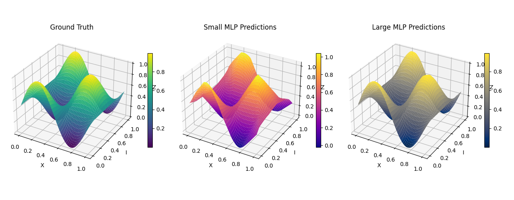

# **2. Tidsserieprognoser med små datasett - Krig mot autoregressoren**  

**_Vi forsøker å utfordre klassiske autoregressive modeller ved hjelp av dyp læring på et lite datasett—og det var en tung kamp._**  

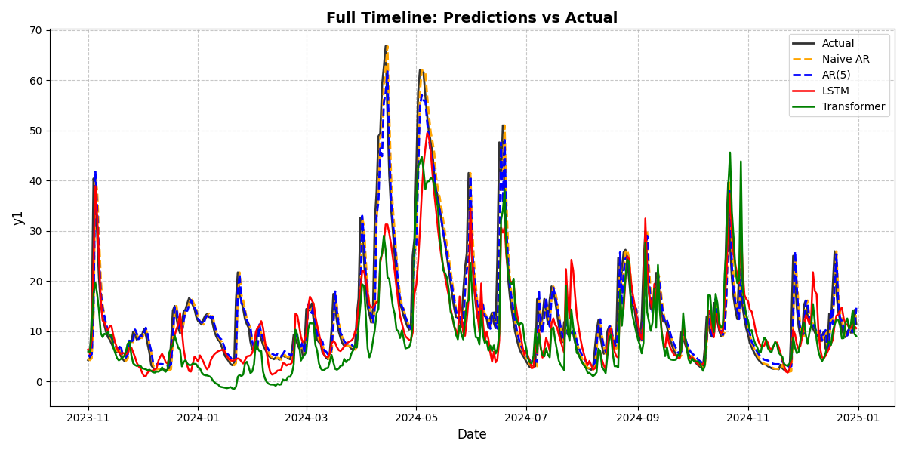  

## 3. Stor vannkraftmodellering - MLPs hevn!

**_Etter å ha utforsket tidsserieprognosering på et lite datasett, vendte vi oppmerksomheten mot en betydelig større utfordring – et vannkraftdatasett fra Å Energi, med millioner av rader og flere målvariabler. Målet vårt var å finne ut om et nøye justert nevralt nettverk kunne overgå tradisjonelle gradient-boosting-modeller i en kompleks multi-output regresjonsoppgave. Underveis håndterte vi dimensjonalitetsproblemer, optimaliserte hyperparametere og sammenlignet modellprestasjoner for å finne den mest effektive tilnærmingen._**

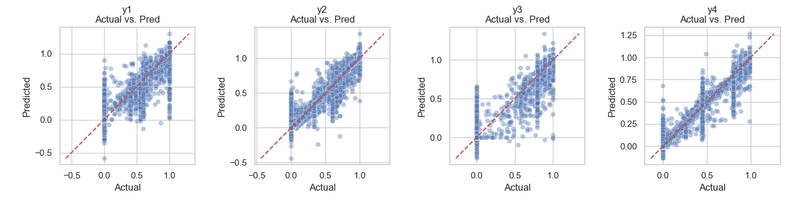

----

## Indeks:

- [1. MLP Sinus-Cosinus-regresjon](#1-mlp-sinus-cosinus-regresjon) 
- [2. Tidsserieprognoser med små datasett – Krig mot autoregressoren](#2-tidsserieprognoser-med-små-datasett--krig-mot-autoregressoren) 
- [3. Stor vannkraftmodellering - MLPs hevn!](#3-stor-vannkraftmodellering--mlps-hevn)  


# 1. MLP Sinus-Cosinus-regresjon

En rask demonstrasjon av bruk av **PyTorch** for å tilpasse en 2D sinus-cosinus-funksjon ved hjelp av to forskjellige Multi-Layer Perceptron (MLP)-arkitekturer:

- **Liten MLP** (moderat kapasitet)  
- **Stor MLP** (høy kapasitet, for å overtilpasse og fange opp fine detaljer)


## Oversikt

1. **Data**  
   Vi har $(x, i)$-par og et mål $z = \sin(\cos(x)) + \sin(\cos(i))$.  
   - Inndata er lagret i `data/X_sincos.txt`
   - Målverdier er lagret i `data/y_sincos.txt`
   - Data levert av Å Energi.

2. **Modeller**  
   - **SmallMLP**: 2 → 100 → 100 → 1 (med ReLU-aktiveringer)  
   - **LargeMLP**: 2 → 100 → 500 → 500 → 100 → 1 (med ReLU-aktiveringer)

3. **Trening**  
   - Vi bruker **MSE Loss** og **Adam Optimizer** i PyTorch.  
   - **LargeMLP** er bevisst overparameterisert for å tilpasse (og til og med overtilpasse) dataene svært godt.

4. **Resultater**  
   - Vi sammenligner den sanne funksjonen med prediksjoner fra begge MLP-ene i en 3D-plot.


> *Fra venstre til høyre*:  
> **(1)** Sann funksjon  
> **(2)** Prediksjoner fra liten MLP  
> **(3)** Prediksjoner fra stor MLP

## Kom i gang

1. **Installer avhengigheter**  
   ```bash
   pip install torch matplotlib numpy
   ```
2. **Kjør scriptet**  
   ```bash
   python 1-sincos.py
   ```
   - Juster hyperparametere (epoker, læringsrate) om ønskelig.

3. **Plotting**  
   Scriptet viser automatisk et 3D-overflateplot for å sammenligne prediksjonene.

## Lærdommer

- **Små vs. store modeller**: Et større nettverk kan tilnærme målfunksjonen svært nøyaktig, men kan overtilpasse dersom datagrunnlaget er begrenset.  
- **Visualisering**: 3D-overflateplott hjelper oss med å visuelt vurdere hvor godt modellen fanger opp den underliggende funksjonen.  
- **PyTorch**: Viser hvor enkelt det er å bygge og trene MLP-er på egendefinerte data med bare noen få linjer Python-kode.

----


# **2. Tidsserieprognoser med små datasett – Krig mot autoregressoren**  

**_Vi forsøker å utfordre klassiske autoregressive modeller ved hjelp av dyp læring på et lite datasett—og det var en tung kamp._**  

  

## **Oversikt**  

Dette prosjektet utforsker forskjellige tilnærminger til å forutsi en daglig tidsserie med kun **~4000 observasjoner** (etter å ha tatt hensyn til lag-funksjoner). Målet var å undersøke om moderne dyp læring—LSTMer og Transformere—kunne overgå klassiske statistiske metoder i en situasjon med lite data.  

Vi testet fire modeller:  

1. **Naiv AR**: Den enkleste baselinen—antar at dagens verdi vil være den samme som i går.  
2. **AR(5)**: En lineær autoregressiv modell som bruker de siste fem dagene for å forutsi neste dag.  
3. **LSTM**: Et rekurrent nevralt nettverk trent på sekvenser av 30 dager.  
4. **Transformer**: En selvoppmerksomhetsmodell som også bruker et 30-dagers vindu.  

### **Vant dyp læring?**  

Ikke denne gangen. Med bare noen få tusen datapunkter og kun tre eksogene variabler (`x1, x2, x3`), slet de nevrale nettverkene med å finne meningsfulle mønstre. De autoregressive modellene, spesielt AR(5), presterte betydelig bedre fordi:  

- Datasettet er **svært lite** (~4000 rader), noe som begrenser læringskapasiteten til dype modeller.  
- De eksogene variablene har **svak forklaringskraft**, noe som betyr at de ikke bidrar mye til prognosen.  
- Tidsserien i seg selv er **sterkt autoregressiv**, noe som betyr at tidligere verdier alene gir et sterkt prediktivt signal—noe de enklere AR-modellene håndterer godt.  

## **Endelige resultater**  

| Modell       | MAE  | MSE  |  
|-------------|------|------|  
| **Naiv AR**  | **2.626**  | **19.377**  |  
| **AR(5)**     | **2.466**  | **17.183**  |  
| LSTM         | 4.930  | 59.427  |  
| Transformer  | 5.853  | 70.126  |  

Både LSTM og Transformer ble klart slått av de naive og AR(5)-modellene. De dype læringsmodellene hadde nesten **dobbelt så høy MAE** og **tre til fire ganger høyere MSE**. En klar seier for den klassiske tilnærmingen i dette tilfellet.  

---

## **Viktige grafer**  

### **Prediksjonstidslinje**  

Denne grafen sammenligner faktiske og predikerte verdier over tid. Jo nærmere en modells prediksjoner følger de virkelige verdiene, desto bedre presterer den.  

📌 **Hva du bør se etter:**  
- Hvilke modeller ligger nærmest de faktiske verdiene? Her gjør de autoregressive modellene en langt bedre jobb.  
- Henger noen modeller konsekvent etter eller overpredikerer målet? Det er ingen systematisk forsinkelse, noe som indikerer at alt er satt opp riktig og at hyperparametrene er rimelige.  
- Hvor mye støy introduserer LSTM og Transformer sammenlignet med AR(5)? Svaret er betydelig støy og tilfeldige topper—datasettet er for lite til at nevrale nettverk kan skinne!  

  

### **Absolutt feil over tid**  

Denne grafen viser hvordan hver modells absolutte feil utvikler seg over tid. Den hjelper med å identifisere perioder hvor modellene sliter mest.  

📌 **Hva du bør se etter:**  
- Er det spesifikke tidsperioder hvor feilene øker kraftig? De største toppene sammenfaller med store bevegelser i $y$, og fordi datasettet ikke inneholder nok forklaringskraft, gjør LSTMer og Transformere store feil.  
- Gjør én modell konsekvent større feil enn de andre?  
- Viser dype læringsmodeller ustabil eller uforutsigbar atferd?  

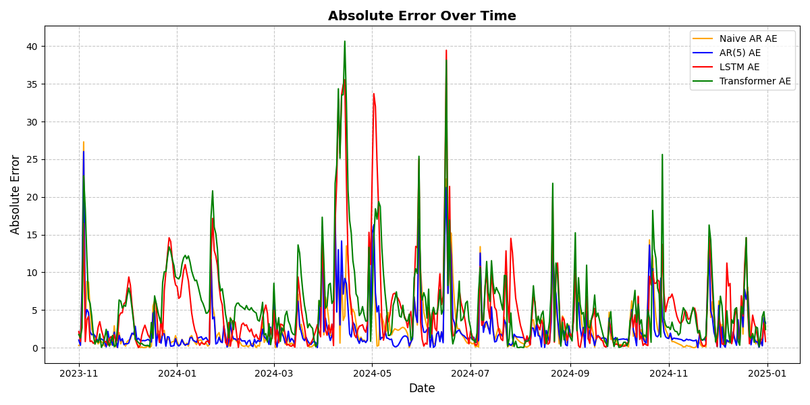  

### **MAE- og MSE-sammenligning**  

Disse søylediagrammene gir en direkte numerisk sammenligning av hvor godt hver modell presterte.  

- **MAE (Mean Absolute Error)** viser gjennomsnittsstørrelsen på feilene på en intuitiv måte.  
- **MSE (Mean Squared Error)** gir større vekt til store feil, noe som gjør den mer følsom for ekstreme avvik.  

📌 **Hva du bør se etter:**  
- AR(5)-modellen oppnår lavest MAE og MSE—vinneren av denne utfordringen.  
- LSTM og Transformer har betydelig høyere feil, noe som viser at de sliter med det begrensede datasettet.  
- Den naive modellen presterer overraskende godt, noe som viser hvor sterkt autoregressiv tidsserien er.  

**MAE-sammenligning:**  
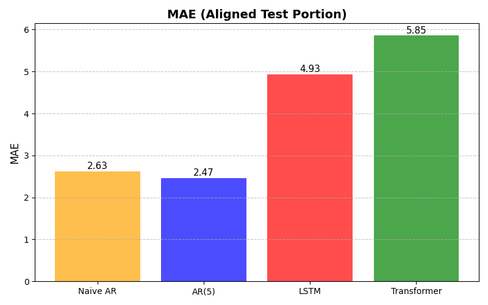  

**MSE-sammenligning:**  
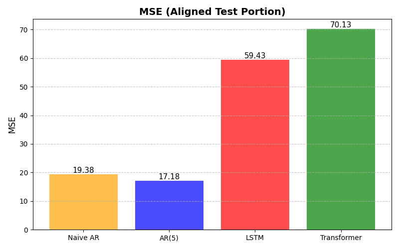  

---

## **Hvordan kjøre koden**  

1. Installer avhengigheter:  
   ```bash
   pip install numpy pandas matplotlib torch scikit-learn
   ```
2. Kjør hovedskriptet:  
   ```bash
   python 2-tahps.py
   ```
3. Sjekk konsollutdata og genererte grafer.  

---

## **Konklusjon**  

Til tross for våre beste forsøk, **vant ikke dyp læring denne kampen**—men det er ikke overraskende. AR(5) og til og med den naive modellen presterte godt fordi tidligere verdier alene inneholdt nok prediktiv informasjon.  

Imidlertid, i et scenario med **mer data** og **sterkere eksogene variabler**, kunne LSTM og Transformer ha gjort det bedre. Foreløpig fremhever dette prosjektet en viktig lærdom innen tidsserieprognoser: **noen ganger er det enkleste også det beste.**  

Vil du eksperimentere? Prøv å legge til flere funksjoner, justere hyperparametere eller bruke forskjellige arkitekturer for å se om du kan vippe vektskålen i favør av dyp læring!  

---

# 3. Stor vannkraftmodellering – MLPs hevn!

> **Mål:** Forutsi flere målvariabler (y1..y4) fra 10 inngangsvariabler (x1..x10).  
> **Data:** Levert av Å Energi, med millioner av rader med driftslogger (vi antar).

## Innholdsfortegnelse

1. [Oversikt](#oversikt)  
2. [Modeller](#modeller)  
   - [Lineær regresjon](#lineær-regresjon)  
   - [XGBoost](#xgboost)  
   - [Multi-Layer Perceptron (MLP)](#multi-layer-perceptron-mlp)  
3. [Resultater](#resultater)  
4. [Fremtidige forbedringer](#fremtidige-forbedringer)  
5. [Repository-struktur](#repository-struktur)

---

## Oversikt

Vi testet tre hovedmetoder for å finne ut hvilken som best forutsier våre fire målvariabler:

1. En klassisk **lineær regresjonsmodell** som baseline.  
2. En **trebasert ensemble-metode**: **XGBoost**.  
3. En **nevralt nettverkstilnærming** med en multi-output **MLP** i PyTorch.

Alle skriptene genererer **metrikker** som RMSE (Root Mean Squared Error) og MAE (Mean Absolute Error). Vi brukte en trenings-/testsplit på 80/20 og evaluerte ytelsen til hver metode.

---

## Modeller

### Lineær regresjon

Vi brukte en enkel **multi-output lineær modell**: for hver målvariabel (y1..y4) forsøker den å tilpasse en lineær funksjon av x1..x10. Ikke overraskende gjorde lineær regresjon det greit, men den fanget ikke opp komplekse sammenhenger. Vår beste MSE lå rundt 0,06–0,07 for de fleste målene, noe som tilsvarer en RMSE på omtrent 0,24–0,28. Flott for tolkbarhet, men ikke for minimalt feilnivå.

**Viktig skript**: [`3-vannkraft-linreg.py`](3-vannkraft-linreg.py)

### XGBoost

**XGBoost** (eXtreme Gradient Boosting) er kjent for å være sterkt på tabulære data – ofte bedre enn nevrale nettverk. Vi brukte **RandomizedSearchCV** for å finne optimale hyperparametere som `max_depth`, `learning_rate`, `subsample`, osv. for hver målvariabel.

**Høydepunkter**:
- Oppnådde RMSE rundt **0,05–0,07** for y1..y4.
- Ekstremt rask på CPU med `tree_method='hist'`.
- Slår vanligvis lineære modeller på ikke-lineære data.

**Viktig skript**: [`3-vannkraft-xgboost.py`](3-vannkraft-xgboost.py)

### Multi-Layer Perceptron (MLP)

"Noen sier nevrale nettverk er overvurdert på strukturerte data!" Vi ville se om en godt justert MLP kunne matche eller overgå XGBoost. Vi bygde en **multi-output** MLP i PyTorch med `output_dim=4`, slik at den forutsier y1..y4 samtidig.

Etter en grundig hyperparametertesting (til tross for noen dokumentasjonsproblemer med skorch i Python 3.13), fant vi en optimal konfigurasjon med:

- **2** skjulte lag  
- **512** nevroner i hvert lag  
- **0,01** dropout  
- En læringsrate på **0,001**  
- Trening i **134** epoker  

**Viktig skript**: [`3-vannkraft-mlp.py`](3-vannkraft-mlp.py)

---

## Resultater

### Lineær regresjon vs. XGBoost vs. MLP

| Metode      | y1 RMSE  | y2 RMSE  | y3 RMSE  | y4 RMSE  | Kommentarer                              |
|-------------|----------|----------|----------|----------|-------------------------------------------|
| **LinearReg** | ~0,25  | ~0,24   | ~0,28   | ~0,27   | Grei baseline, men ikke best              |
| **XGBoost**   | ~0,07  | ~0,06   | ~0,06   | ~0,05   | Sterk ytelse, lett å justere              |
| **MLP**       | ~0,06  | ~0,045  | ~0,043  | ~0,033  | Overgikk faktisk XGBoost i disse testene! |

> **Merk:** Tabellen ovenfor er en rask oppsummering. Tallene er basert på endelige testresultater (se nedenfor).

**Grafer**  
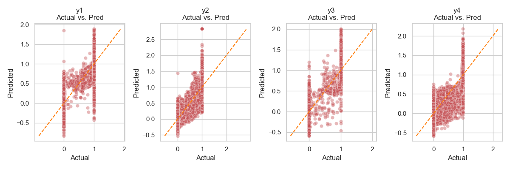  
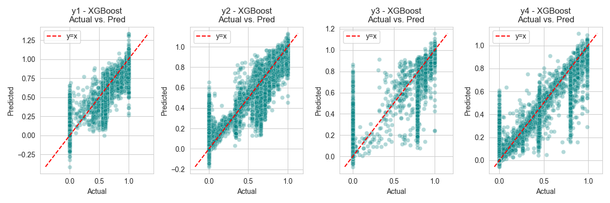  
  

**Detaljerte metrikker**:

- **XGBoost**  
  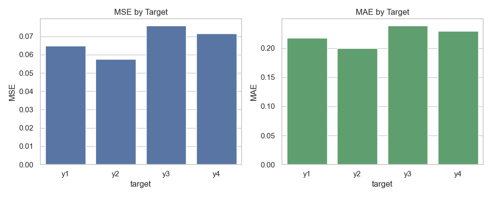
  - y1: MSE=0.005233 (RMSE=0.0723), MAE=0.0364  
  - y2: MSE=0.003901 (RMSE=0.0625), MAE=0.0297  
  - y3: MSE=0.003477 (RMSE=0.0590), MAE=0.0202  
  - y4: MSE=0.002654 (RMSE=0.0515), MAE=0.0170  

- **MLP** 
  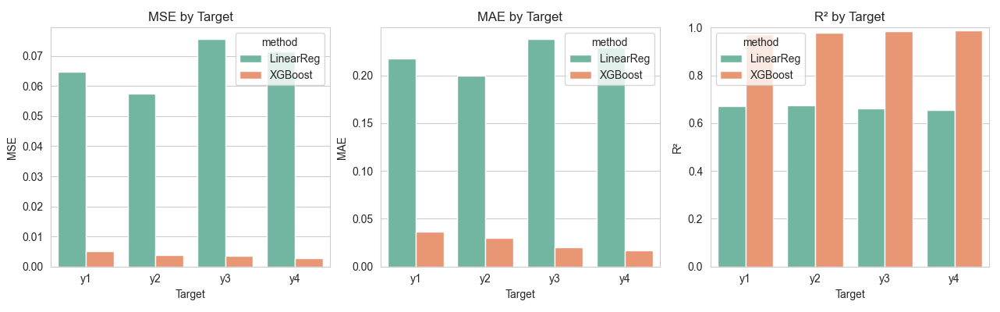 
  - y1: MSE=0.003587 (RMSE=0.0599), MAE=0.0231  
  - y2: MSE=0.002085 (RMSE=0.0457), MAE=0.0213  
  - y3: MSE=0.001892 (RMSE=0.0435), MAE=0.0129  
  - y4: MSE=0.001143 (RMSE=0.0338), MAE=0.0128  

- **Linear Regression**  
  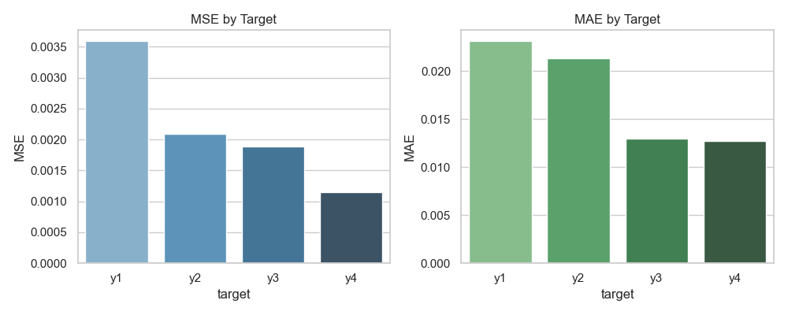
  - y1: MSE=0.064769 (RMSE=0.2545), MAE=0.2177  
  - y2: MSE=0.057551 (RMSE=0.2399), MAE=0.2000  
  - y3: MSE=0.075656 (RMSE=0.2751), MAE=0.2381  
  - y4: MSE=0.071608 (RMSE=0.2676), MAE=0.2291  

**Konklusjon**: MLP presterer litt bedre enn XGBoost i de endelige kjøringene – noe uvanlig for rent tabulære data, men det viser at med tilstrekkelig hyperparameterjustering og muligens det store datasettet, kan MLP utmerke seg.

---

## Fremtidige forbedringer

Vi kan forbedre modellene ytterligere ved å:

1. **Bruke PCA**  
   - Korrelasjonsanalysen viste noen redundante variabler. Redusere dimensjonaliteten til ~4–6 hovedkomponenter kan forbedre generalisering.
2. **Utforske flere modeller**  
   - Kanskje **LightGBM** eller **CatBoost** for bedre GPU-utnyttelse eller innebygd støtte for kategoriske variabler.
3. **Domeneinnsikt**  
   - Kunnskap om hydrokraftens fysiske sammenhenger kan hjelpe oss med feature engineering eller modellforbedringer.
4. **Dypere nevrale nettverk eller transformere**  
   - Ikke alltid fordelaktig for tabulære data, men spesialiserte modeller som TabNet eller en tilpasset Transformer kan avsløre skjulte mønstre.
5. **Mer omfattende hyperparametertesting**  
   - Med 25+ millioner rader kunne vi bruke HPC eller GPU-ressurser for en grundigere søk.

---

## Repository-struktur

```
.
├── hyperparam_tuning/
│   ├── hyper_xgboost.py        # Kode for å finne beste XGBoost-parametere
│   ├── hyper_mlp.py            # PyTorch MLP hyperparameter-søk
│   └── ... andre eksperimenter
├── 3-vannkraft-linreg.py       # Endelig multi-output lineær regresjonsmodell
├── 3-vannkraft-xgboost.py      # Endelig XGBoost-modell + grafer
├── 3-vannkraft-mlp.py          # Endelig MLP-modell + grafer
├── data/
│   └── vannkraft_data.txt      # Datasettet (tab-separert)
└── README.md                   # Denne filen (med resultater + analyse)
```

Vi håper dette prosjektet demonstrerer vår kompetanse innen **modellering av tabulære data** og vår vilje til å eksperimentere med ulike metoder. Vi hadde det gøy med å jakte på bedre RMSE-verdier (hvem skulle tro at 0,05 → 0,033 kunne føles så tilfredsstillende?).


💬 **Spørsmål eller tilbakemeldinger?**  
Ta gjerne kontakt eller opprett en issue – diskuterer gjerne prognoser og maskinlæring!

---
